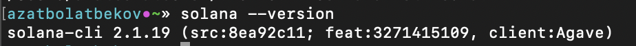
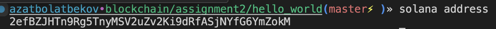
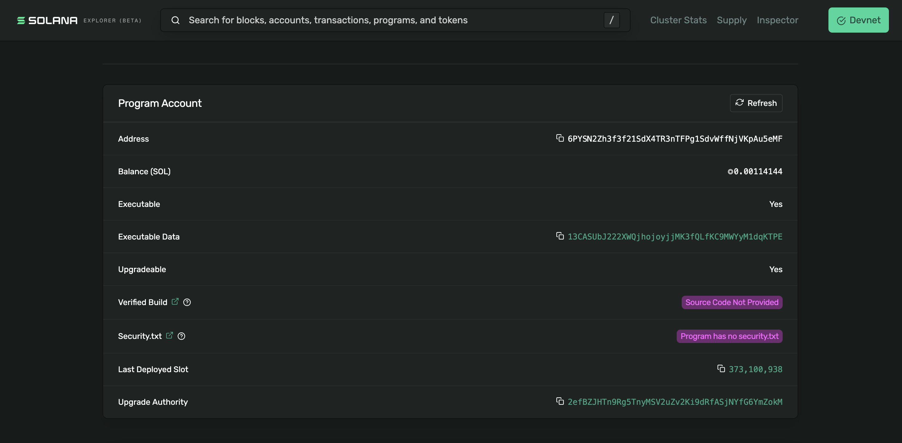

# 🚀 Solana Hello World Deployment

This project demonstrates how to set up the Solana CLI and deploy a simple Rust-based smart contract (Hello World) to the Solana `devnet`.

---

## 📦 Usage

### 1. Install Solana CLI

Follow the official installation guide:  
🔗 [https://solana.com/docs/cli/install-solana-cli-tools](https://solana.com/docs/cli/install-solana-cli-tools)

```bash
sh -c "$(curl -sSfL https://release.solana.com/stable/install)"
```

Check the CLI version:

```bash
solana --version
```

---

### 2. Clone and Build the Hello World Program

```bash
git clone https://github.com/solana-labs/example-helloworld.git
cd example-helloworld
cargo build
```

---

### 3. Configure Devnet

```bash
solana config set --url https://api.devnet.solana.com
solana airdrop 2
solana address  # Copy this wallet address
```

---

### 4. Deploy the Program

```bash
solana program deploy dist/program/helloworld.so
```

Copy your **Program ID** shown after deployment.

---

## 🧾 Example Output

```bash
Solana CLI Version: 1.18.x
Wallet Address: HsG...Abc1
Program ID: 5F...zU2X
```

---

## 🖼️ Demo Screenshot

### Screenshot of Solana CLI


### Screenshot of Wallet Address


### Screenshot of Deploy


---

## 📁 Project Structure

```
📦example-helloworld/
 ┣ 📂src/
 ┣ 📂dist/
 ┣ 📜README.md
 ┣ 📜Cargo.toml
 ┣ 📜package.json
 ┗ 📜LICENSE
```

---

## 📜 LICENSE

License inherited from Solana’s official Hello World repo:  
🔗 https://github.com/solana-labs/example-helloworld/blob/master/LICENSE

---
